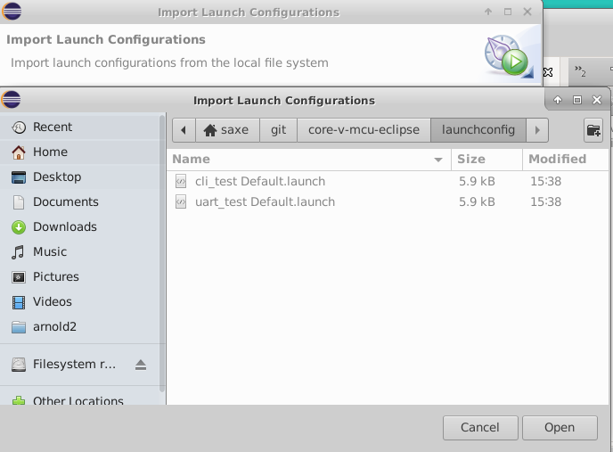

# core-v-mcu-cli-test
Command-Line-Interface test routines for the CORE-V MCU.
Core-v-mcu-cli-test runs on FreeRTOS and can be used from a terminal emulator or via the Eclipse IDE.
At the time of this writing (2022-03-09) `cli-test` runs under Verilator or in emulation on a Digilent Nexys A7-100T evaluation kit.
Setup instructions for the Nexys A7 and a terminal emulator to run `cli-test` can be found in the [core-v-mcu quick start guide](https://github.com/MikeOpenHWGroup/core-v-mcu/blob/qsg/emulation/quickstart/README.md).

It is expected that the majority of `cli-test` users will want to run it from an Integrated Development Environment.
The remainder of this document will get you set up with the Eclipse-IDE.

### Eclipse IDE Installation
The Eclipse IDE relies on a larger ecosystem of tools and these instructions assume you are familar enough with the Eclispe IDE environment to make any required configuration changes to the IDE setup.

### Step 1:
Downlad and install the approriate corev-gcc toolchain from
~~~
https://www.embecosm.com/resources/tool-chain-downloads/#corev
~~~

### Step 2:
Download and install the **Eclipse IoT Embedded CDT IDE** (this will eventually be replaced by a pre-configured CORE-V IDE based on the Eclipse IDE tools).  
~~~
https://projects.eclipse.org/projects/iot.embed-cdt/downloads
~~~

### Step 3:
Install OpenOCD.  Recommend getting it from this location:
~~~
https://sourceforge.net/projects/openocd/files/openocd/
~~~
Version 0.11.0-rc2 is know to work with this setup.

Installation is accomplished by:
~~~
./configure --enable-ftdi && make
sudo make install
~~~ 

### Step 4: run the Eclipse IDE and import projects directly from this OpenHW git repo

NOTE: importing the `cli_test` project into the IDE does not import the information to launch the debugger, so after importing cli_test, be sure to either import the launch configuration (below in Step 5) or create your own.

#### Step 4.1: Launch Eclipse
~~~
eclipse
~~~

#### Step 4.2: From Welcome, select Import

#### Step 4.3: Select Import Projects from Git

#### Step 4.4: Specify Clone URL

#### Step 4.5: Tell Git which repo to use (core-v-mcu-eclipse-cli-test)

#### Step 4.6: Select the branch to clone

#### Step 4.7: Specify directory for git to use (use the default)

#### Step 4.8: Select which Wizard to use for import

#### Step 4.9: Tell it which projects to import (cli_test is the only one you need)

#### Step 4.10: What you should see after slected 'Finish'

### Step 5: Import launch configuration.

This step pulls in the launch configurations which are configured to use hs2 and OpenOCD.
If your hardware setup is different, you can either ignore this step and create your own, or use this step and modify to fit your configuration.

#### Step 5.1:
Select 'Import...'.

#### Step 5.2:
Select Launch Configurations.

#### Step 5.3:
Browse to the git directory that was chosen as the Local Destination.

#### Step 5.4:
Select launchconfig and cli_test Default.

#### Step 5.5:
Under the `Run` menu select `Debug Configurations...`

#### Step 5.6:
Under `GDB OpenOCD Debugging` select `cli_test Default` and then `Debug`.

This should compile, link and load the application and stop at main waiting for you to start debugging.

## Emulation bitsream
Bistreams compatible with the Nexys A7-100T can be found at:
http://downloads.openhwgroup.org/

## Peripheral support
The type and number of peripherals supported are defined by `pulp_soc_defines.sv`.
The information is made available to software applications as a series of #define values in the 'SOC options' section of 'target/core-v-mcu/include/core-v-mcu-config.h'.
An example configuration is:
~~~
// SOC options
#define N_IO                 48         // Total available IO
#define N_SYSIO              3
#define N_GPIO               32
#define N_UART               2          // Number of uarts
#define N_QSPIM              1          // Number of QuadSPI masters
#define N_I2CM               2          // Number of I2C masters
#define N_I2SC               0
#define N_CSI2               0
#define N_HYPER              0
#define N_SDIO               0
#define N_CAM                1
#define N_JTAG               0
#define N_MRAM               0
#define N_FILTER             1
#define N_FPGA               1
#define N_EXT_PER            0
#define N_EFPGA_TCDM_PORTS   4
#define N_FPGAIO             43
#define N_EFPGA_EVENTS       16
~~~
