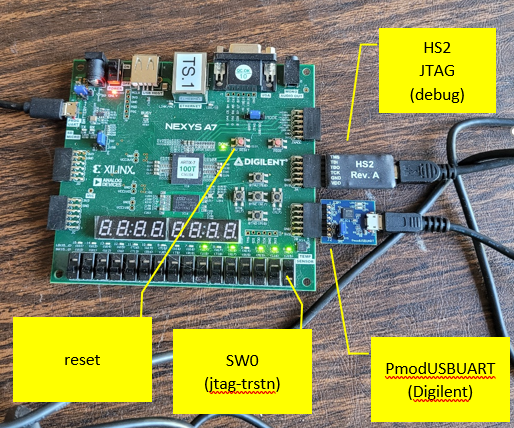
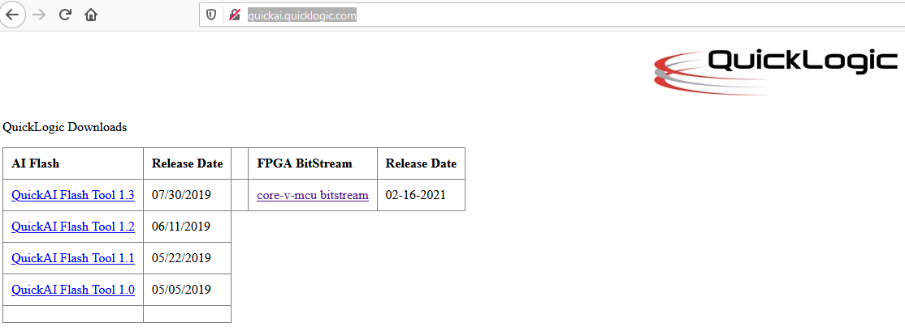

# core-v-mcu-cli-test
Eclipse/FreeRTOS/core-v-mcu example program

### Installation
Eclipse relies on a larger ecosystem of tools.  This project uses a particualr set of tools in a particualr set of locations.  These instructions do not cover loading the other tools, or adapting the preferences to point to different tools or different locations.  These instructions assume that you are familar enough with Eclispe to make any required changes.
### Step 1:
Downlad and install the approriate corev-gcc toolchain from
~~~
https://www.embecosm.com/resources/tool-chain-downloads/#corev
~~~

### Step 2: 
Download and install Eclipse for Embedded and not Host based eclipse.  
~~~
https://projects.eclipse.org/projects/iot.embed-cdt/downloads
~~~

### Step 3:
Install OpenOCD.  Recommend getting it from this location:
~~~
https://sourceforge.net/projects/openocd/files/openocd/
~~~
I used 0.11.0-rc2.

Installation is accomplished by:
~~~
./configure --enable-ftdi && make
sudo make install
~~~ 

### Step 4: run Eclipse, import projects directly from git (import launch in step 5)

Alternative to the instructions below to build the project from the commandline - 
~~~
git clone git@github.com:Quicklogic-Corp/core-v-mcu-cli-test.git core-v-mcu-cli-test
cd core-v-mcu-cli-test/cl_test
./cli_build <my_new_repo>
~~~
The cli_build will create a binary image (image.bin) in the Default directory directory that can be programmed into an HS2  PMOD plugged into the lower row of the JB Pmod slot.

To program the SPI flash device requires the uart1 connection on the upper row of the JB Pmod. (a USB2UART Pmod on the top row of JB will connect the uart1).
From the core-v-mcu-cli_test/cli_test run the following command
~~~
python spi_load /dev/ttyUSB0
3.7.5 (default, Nov  7 2019, 10:50:52) 
[GCC 8.3.0]
pygame 2.0.0 (SDL 2.0.12, python 3.7.5)
Hello from the pygame community. https://www.pygame.org/contribute.html
Ready to Program SPI
Logging to logfile.txt
~~~
Then from the uart0 console connected to the digilent uart run the following command
~~~
#*******************                                                      
Command Line Interface                                                          
App SW Version: cli_test v0.1                                                   
                                                                                
#*******************                                                            
[0] > qspi program Default/cli.bin 0x0                                          
Loading file:  = Default/cli.bin                                                
addr = 0x00000000                                                               
Expecting 00035070 bytes                                                        
Erasing 4k page at 00000000                                                     
Erasing 4k page at 00001000                                                     
Erasing 4k page at 00002000                                                     
Erasing 4k page at 00003000                                                     
Erasing 4k page at 00004000                                                     
Erasing 4k page at 00005000                                                     
Erasing 4k page at 00006000                                                     
Erasing 4k page at 00007000                                                     
Erasing 4k page at 00008000                                                     
Erasing 4k page at 00009000                                                     
Erasing 4k page at 0000a000                                                     
Erasing 4k page at 0000b000                                                     
Erasing 4k page at 0000c000                                                     
Erasing 4k page at 0000d000                                                     
Erasing 4k page at 0000e000                                                     
Erasing 4k page at 0000f000                                                     
Erasing 4k page at 00010000                                                     
Erasing 4k page at 00011000                                                     
Erasing 4k page at 00012000                                                     
Erasing 4k page at 00013000                                                     
Erasing 4k page at 00014000                                                     
Erasing 4k page at 00015000                                                     
Erasing 4k page at 00016000                                                     
Erasing 4k page at 00017000                                                     
Erasing 4k page at 00018000                                                     
Erasing 4k page at 00019000                                                     
Erasing 4k page at 0001a000                                                     
Erasing 4k page at 0001b000                                                     
Erasing 4k page at 0001c000                                                     
Erasing 4k page at 0001d000                                                     
Erasing 4k page at 0001e000                                                     
Erasing 4k page at 0001f000                                                     
Erasing 4k page at 00020000                                                     
Erasing 4k page at 00021000                                                     
Erasing 4k page at 00022000                                                     
Erasing 4k page at 00023000                                                     
Erasing 4k page at 00024000                                                     
Erasing 4k page at 00025000                                                     
Erasing 4k page at 00026000                                                     
Erasing 4k page at 00027000                                                     
Erasing 4k page at 00028000                                                     
Erasing 4k page at 00029000                                                     
Erasing 4k page at 0002a000                                                     
Erasing 4k page at 0002b000                                                     
Erasing 4k page at 0002c000                                                     
Erasing 4k page at 0002d000                                                     
Erasing 4k page at 0002e000                                                     
Erasing 4k page at 0002f000                                                     
Erasing 4k page at 00030000                                                     
Erasing 4k page at 00031000                                                     
Erasing 4k page at 00032000                                                     
Erasing 4k page at 00033000                                                     
Erasing 4k page at 00034000                                                     
Erasing 4k page at 00035000                                                     
00035070 Bytes received                                                
[0] > 
~~~
The eclipse GUI muste ued intially to download and run the CLI tests to be able to program the SPI device.  Once the SF3 is programmed, setting SW1 to off and pressing the reset button  (next to the done LED) will reboot the board using the SPI programmed image

NOTE: importing the cli_test does not import the information to launch the debugger, so after importing cli_test, be sure to either import the launch configuration or create your own.

1 Launch Eclipse
~~~
eclipse
~~~

2 From Welcome, select Import

3 Select Import Projects from Git

4 Specify Clone URL

5 Tell Git which repo to use (core-v-mcu-eclipse-cli-test)

6 Select the branch to clone

7 Specify directory for git to use (I use the default)

8 Select which Wizard to use for import

9 Tell it which projects to import (cli_test is the only one you need)

10 What you should see after slected 'Finish'

# Step 5: Import launch configuration
This step pulls in the launch configurations which are configured to use hs2 and OpenOCD.
If your hardware setup is different, you can either ignore this step and create your own, or use this step and modify to fit your configuration.

1 Select 'Import...'

2 Select Launch Configurations

13 Browse to the git directory that was chosen as the Local Destination

14 Select launchconfig and cli_test Default

15 Under the 'Run' menu select 'Debug Configurations...'

15 Under 'GDB OpenOCD Debugging'  select 'cli_test Default' and then 'Debug'

This should compile, link and load the application and stop at main waiting for you to start debugging.

## Emulation hardware
The intent is to support more than one emulation platform.
Currently only one board is supported:

* Nexys A7 100T

## Emulation bitsream
Bistreams compatible with the Nexys A7 100T can be found at:
http://quickai.quicklogic.com/

TODO: need to move bitstreams to an Open Hardware URL.

## Peripheral support
The type and number of peripherals supported are defined by 'pulp_soc_defines.sv'.
The information is made available to software applications as a series of #define values in the 'SOC options' section of 'target/core-v-mcu/include/core-v-mcu-config.h'.
An example configuration is:
~~~
// SOC options
#define N_IO                 48         // Total available IO
#define N_SYSIO              3
#define N_GPIO               32
#define N_UART               2          // Number of uarts
#define N_QSPIM              1          // Number of QuadSPI masters
#define N_I2CM               2          // Number of I2C masters
#define N_I2SC               0
#define N_CSI2               0
#define N_HYPER              0
#define N_SDIO               0
#define N_CAM                1
#define N_JTAG               0
#define N_MRAM               0
#define N_FILTER             1
#define N_FPGA               1
#define N_EXT_PER            0
#define N_EFPGA_TCDM_PORTS   4
#define N_FPGAIO             43
#define N_EFPGA_EVENTS       16
~~~
