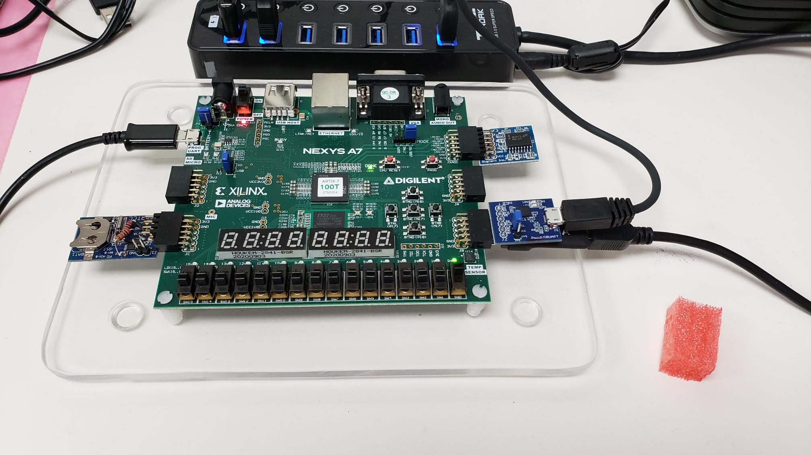

# core-v-mcu auto-test

## Purpose
The purpose of the automatic test system is to run automated tests on the core-v-mcu emulation system.
The system has two main software components: test.py and the cli-test app.
The system runs on a Nexys A7 platform with various peripherals atatched to test the peripheral controllers.
## test.py
Test.py is a python script that reads a json test script, and uses serial ports to run the cli-test app on the emulation system.

Running test.py requires 2 parameters:

* --console serial-port
* --uart1 serial-port

The json file is expected to be named test.json.

An example is:
~~~
python3 test.py --console /dev/ttyUSB3 --uart1 /dev/ttyUSB1
~~~

TODO:

* make UART1 optional
* parameterize the json file

test.py will read the json file (more on this below), run the tests, echo the outputs and report the overall results.

## test.json
The test.json file contains an array of named tests, where each named test contains a sequence of one or more steps.
Each step is a pair of strings:
* control string -- specifies which serial port an what direction
    - ">console" -- write value string to console
    - "<uart1" -- expect value string on uart1

The idea is that each named test tests a subsystem, and thus it is simple to develop a test for one subsystem and then add to the test for other subsystems.
An example test.json file is:
~~~
{
	"initialize" : [
		{">console"		: "exit <<DONE>>\r\n"}
	],
	"uart1" : [
		{">console"		: "uart1 tx hello\r\n"},
		{"<uart1"			: "hello\r\n"}
	],
	"mem"	: [
		{">console"		: "mem start\r\n"},
		{">console"		: "mem test check\r\n"}
	],
	"i2c0"	: [
		{">console"		: "i2cm0 test singlebyte 0xDE 0x20\r\n"},
		{">console"		: "i2cm0 test singlebyte 0xDE 0x00\r\n"}
	]
}
~~~
### initialize
The first named test is initialze.  The purpose of this step is to synchronize the state of the test.py script with the state of the cli-test app.
The single step is:
~~~
{">console"		: "exit <<DONE>>\r\n"}
~~~
The function of this step is to send "exit \<\<DONE>>" to the cli.
The cli will echo the command, and if the current level is >0 will exit that level.
(When cli-test is started, the cli will be at level 0, so this command will have no effect).

The purpose of the \<\<DONE>> is to help make it easier to debug long test scripts.
Test.py scans for \<\<XXX>> to determine the status of the test:
* \<\<PASSED>> means the step executed a test that passed
* \<\<FAILED>> means the step executed a test that failed
* \<\<DONE>> means the step executed an action that doesn't test anything, and so does not return a status

Test.py counts the total number of steps executed, and reports if the sum of DONE, PASSED and FAILED does not equal the total number of steps.  For instance, if a test misspelled FALED that would show up as a command that 'returned no status' alerting you to the problem.

### uart1
The second named test tests uart1 (uart0 is implicitly tested by accessing the console).
~~~
"uart1" : [
		{">console"		: "uart1 tx hello\r\n"},
		{"<uart1"			: "hello\r\n"}
	],
~~~
The first step tells the cli to run the tx command in the uart1 submenu with parameter 'hello\r\n'.
As you might expect from the name, this sends the string 'hello\r\n' to uart1.
The second step tells test.py to expect to see "hello\r\n" on uart1.

### mem
The third named test tests the memory.
~~~
"mem"	: [
		{">console"		: "mem start\r\n"},
		{">console"		: "mem test check\r\n"}
	],
~~~
The first step doe not perform a test, just runs the 'start' function in the mem submenu which writes the address of the free memory to the log file.
The second step runs the test 'check' in the mem submenu.  This test writes the address of the location into all locations greater than the app and less that 512KB.

## i2c0
The fourth named test test i2C0, which is assumed to have the PmodRTCC connected.
~~~
"i2c0"	: [
		{">console"		: "i2cm0 test singlebyte 0xDE 0x20\r\n"},
		{">console"		: "i2cm0 test singlebyte 0xDE 0x00\r\n"}
	]
~~~
The first step runs the test 'singlebyte 0xDE 0x20' from the i2cm0 submenu. 
This test writes and reads 0xA5 and 0x5A to register 0x20 (first location of SRAM) of device 0xDE.
The first step runs the test 'singlebyte 0xDE 0x00' from the i2cm0 submenu. 
This test writes and reads 0xA5 and 0x5A to register 0x00 (control + seconds) of device 0xDE.
(I did not expect this test to pass, but it does.  I think this is because it executes quickly enough that the RTCC does not have time to update the register.)

## cli-test
The suggested organization for the cli-test is:
* Level 0: list of sub-menus, one per sub-system
* Level 1: functions for interactive use and a 'test' submenu for tests
* Level 2: tests which are self-checking and return PASSED or FAILED

Example of Level 0 menu:
~~~
// Main menu
const struct cli_cmd_entry my_main_menu[] = {

		CLI_CMD_SUBMENU( "misc", 	misc_functions, 	"miscellaneous functions" ),
		CLI_CMD_SUBMENU( "uart1", 	uart1_functions, 	"commands for uart1" ),
		CLI_CMD_SUBMENU( "mem", 	mem_functions, 		"commands for memory" ),
		CLI_CMD_SUBMENU( "io", 		io_functions, 		"commands for io" ),
		CLI_CMD_SUBMENU( "gpio", 	gpio_functions, 	"commands for gpio" ),
		CLI_CMD_SUBMENU( "i2cm0", 	i2cm0_functions, 	"commands for i2cm0" ),
		CLI_CMD_SUBMENU( "i2cm1", 	i2cm1_functions, 	"commands for i2cm1" ),
		CLI_CMD_SUBMENU( "efpga", 	efpga_cli_tests,    "commands for efpga connectivity"),
		CLI_CMD_TERMINATE()

};
~~~
Example of Level 1 sub-menu:
~~~
// mem menu
const struct cli_cmd_entry mem_functions[] =
{
		CLI_CMD_SIMPLE( "start", 	mem_print_start,   	"print start of unused memory" ),
		CLI_CMD_SIMPLE( "peek", 	mem_peek,         	"0xaddr -- print memory location " ),
		CLI_CMD_SIMPLE( "poke",     mem_poke,         	"0xaddr 0xvalue -- write value to addr" ),
		CLI_CMD_SIMPLE( "md.b", 	mem_peek_8,         "0xaddr -- print 8-bit memory location " ),
		CLI_CMD_SIMPLE( "mw.b",     mem_poke_8,         "0xaddr 0xvalue -- write 8-bit alue to addr" ),
		CLI_CMD_SIMPLE( "md.w", 	mem_peek_16,        "0xaddr -- print 16-bit memory location " ),
		CLI_CMD_SIMPLE( "mw.w",     mem_poke_16,        "0xaddr 0xvalue -- write 16-bit value to addr" ),
		CLI_CMD_SIMPLE( "md.l", 	mem_peek,         	"0xaddr -- print 32-bit memory location " ),
		CLI_CMD_SIMPLE( "poke",   	mem_poke,         	"0xaddr 0xvalue -- write value to addr" ),
		CLI_CMD_SUBMENU( "test", 	mem_tests, 			"tests" ),
		CLI_CMD_TERMINATE()
};
~~~
Functions such as 'peek' and 'poke' that are used for debug are present at this level.
Automated tests are collected in the tests sub-menu.

Example of Level 2 test sub-menu:
~~~
// mem tests menu
const struct cli_cmd_entry mem_tests[] =
{
		CLI_CMD_SIMPLE( "check", 	mem_check,         	"print start of unused memory" ),
		CLI_CMD_TERMINATE()
};
~~~
Example of a test: mem test check
~~~
static void mem_check(const struct cli_cmd_entry *pEntry)
{
	(void)pEntry;
	// Add functionality here
	bool  fPassed = true;
	extern char __l2_shared_end;
	uint32_t*  pl;
	for (pl = (uint32_t*)(&__l2_shared_end); (uint32_t)pl < 0x1c080000; pl++) {
		*pl = (uint32_t)pl;
	}

	// pl=0x1c070000; *pl = 76;  // Enable to force an error

	for (pl = (uint32_t*)(&__l2_shared_end); (uint32_t)pl < 0x1c080000; pl++) {
		if (*pl != (uint32_t)pl) {
			dbg_str_hex32("mem check fail at", (uint32_t)pl);
			dbg_str_hex32("read back        ", *pl);
			fPassed = false;
			break;
		}
	}
	if (fPassed) {
		dbg_str("<<PASSED>>");
	} else {
		dbg_str("<<FAILED>>");
	}
}
~~~
Note loop to write address of word into the word, and then a second loop to check that it was written properly.
A helpful message if a failure is detected, and finally the check writes \<\<PASSED>> or \<\<FAILED>> to report status.

## log file
The log file produced by this example test is:
~~~
-----------------------------------
-
- core-v-mcu2 test
-
-----------------------------------
Opened console(/dev/ttyUSB3)
Opened uart1(/dev/ttyUSB1)
*** initialize ***
>>exit <<DONE>>

exit <<DONE>>
(at top)
[0] > 

*** uart1 ***
>>uart1 tx hello

uart1 tx hello
string = hello
<<DONE>>[0] > 

Got uart1: hello

<<PASSED>>
*** mem ***
>>mem start

mem start
l2_shared_end: 0x1c01d6e0
<<DONE>>[0] > 

>>mem test check

mem test check
<<PASSED>>[0] > 

*** i2c0 ***
>>i2cm0 test singlebyte 0xDE 0x20

i2cm0 test singlebyte 0xDE 0x20
i2c_addr = 0x000000de
reg_addr = 0x00000020
First access: 165
Second access: 90
<<PASSED>>[0] > 

>>i2cm0 test singlebyte 0xDE 0x00

i2cm0 test singlebyte 0xDE 0x00
i2c_addr = 0x000000de
reg_addr = 0x00000000
First access: 165
Second access: 90
<<PASSED>>[0] >> 

0 commands returned no status
4 commands PASSED
0 commands FAILED
~~~

At the start of each named test, the name of the test is added to the log (for example for mem)
~~~
*** mem ***
~~~
Then the log for all of the steps:
~~~
>>mem start

mem start
l2_shared_end: 0x1c01d6e0
<<DONE>>[0] > 

>>mem test check

mem test check
<<PASSED>>[0] > 
~~~
In this case the informational 'mem start', followed by the test 'mem test check' which returned PASSED.

At the end of the log is the overall summary:
~~~
0 commands returned no status
4 commands PASSED
0 commands FAILED
~~~
Which says that all comamnds returned some status {DONE, PASSED, or FAILED}, 4 commands returned the PASSED status, and no commands returned the FAILED status.

## Preferred Practices

* Level 0 CLI menu is a list of sub-menus, one for each sub-system
* Level 1 CLI menus contain a test sub-menu that will handle the tests (operations that check a result) and functions used for debug
* CLI subroutines that check for an expected result, and so can determine PASS or FAIL should have test in the name
* CLI subroutines that perform some action, but don't check for a result should have function in the name, and if used in a test script should print \<\<DONE>>

## Hardware Setup
The test setup that I use is a Nexys A7-100T board with:
* Digilent HS2 connected to JA
* Digilent PmodUSBUART connected to JB
* Digilent PmodRTCC connected to JD

